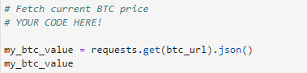

# Fintech-API

The kernel file includes a demonstration of using pandas and matplotlib to plot data gathered from an alpaca API.

To access the code, click the link below or above!  

## Overview

1. Step one - intiated the alpaca trade API to pull the data from online. We used that API to specifically pull bitcoin data, as shown below in the image.

2.
