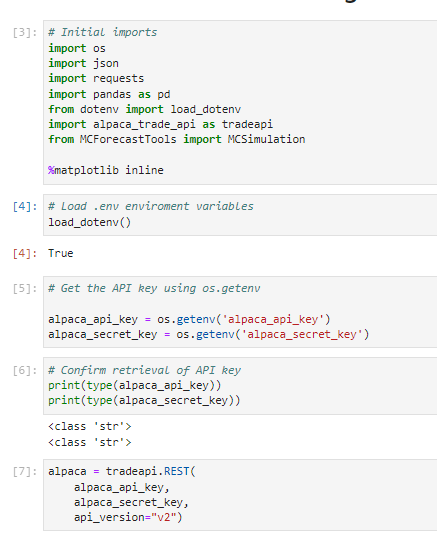
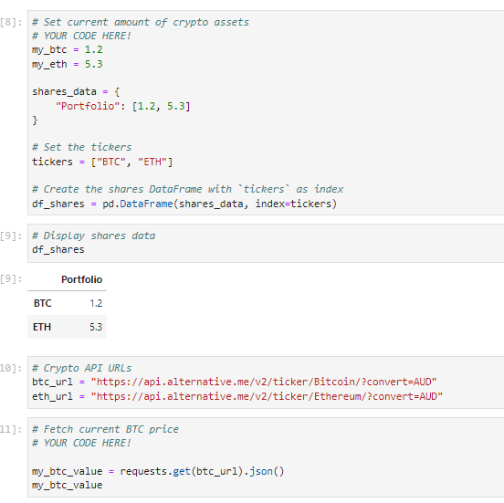
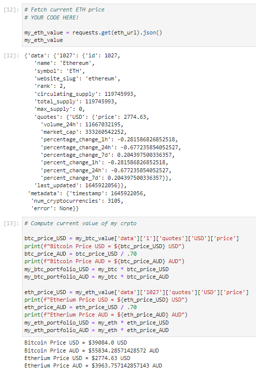
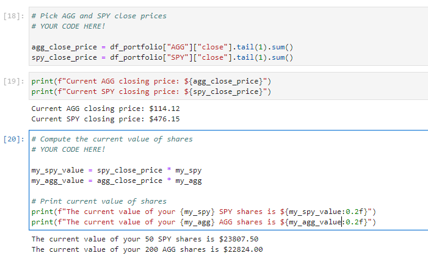
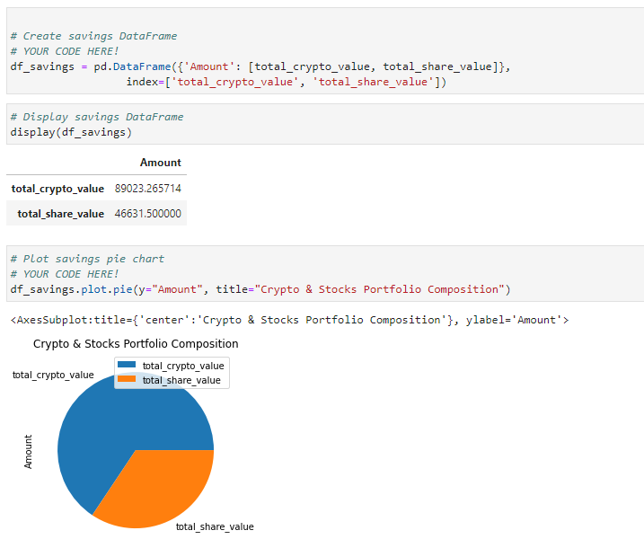
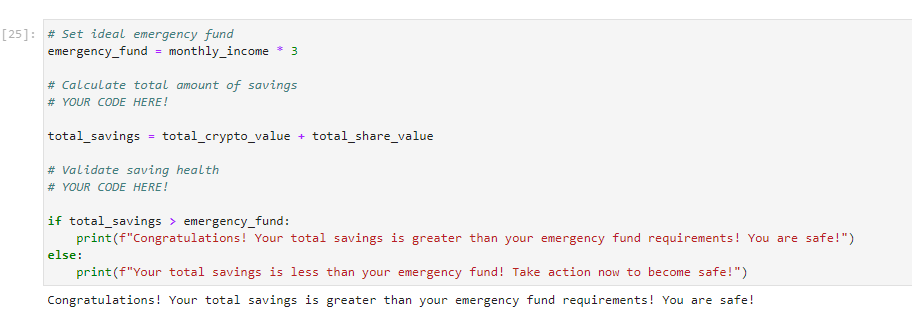
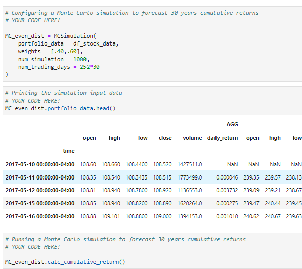
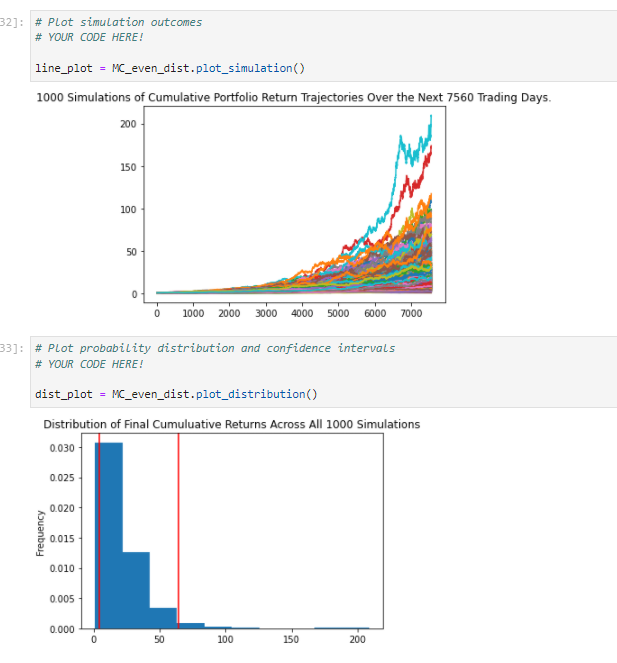
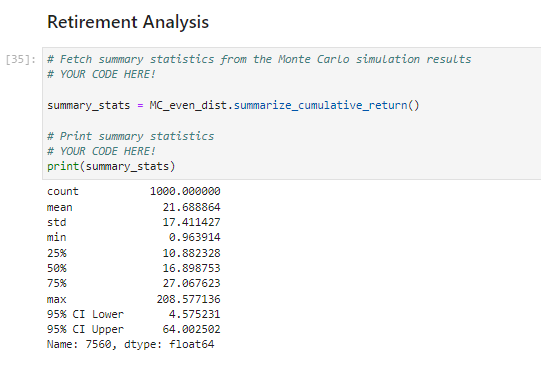
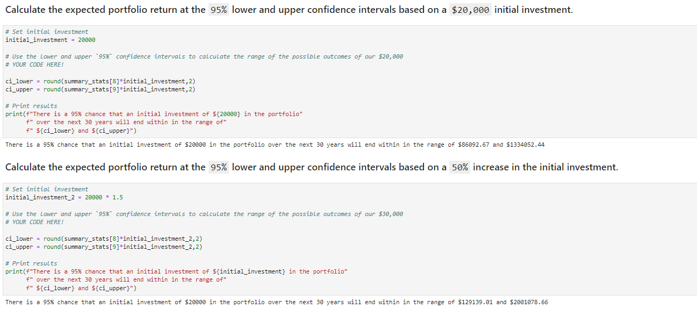

# Fintech-API

The kernel file includes a demonstration of using pandas and matplotlib to plot data gathered from an alpaca API.

To access the code, click the link below or above!  

- [Financial Planner](https://github.com/muramemory/Fintech-API/blob/main/financial_planner.ipynb)

## Overview

### 1. Step one - Data Intialising & Crypto Portfolio

Intiated the alpaca trade API to pull the data from online. We used that API to specifically pull bitcoin data, as shown below in the image.

### 2. Step two - Find Stock Prices & Create Pie Plot 

Createad a pie plot with the price we discovered of stocks 'AGG' and 'SPY' and therfore the total amount owning in the portfolio.

Programmed an emergency fund message to let the user know if their portfolio has hit emergency levels.

### 3. Step three - Monte Carlo Simulation

Created a monte carlo simulation of the stock portfolio to see possible outcomes over 30 years for the portfolio.

###  4 . Step four - Expected Portfolio return

